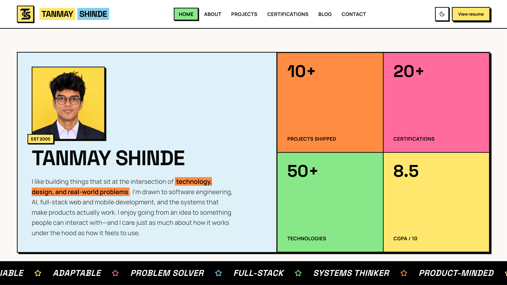

# Portfolio 2026

Personal portfolio website of **Tanmay Shinde** — a full-stack developer based in Pune, India.

Built with Next.js App Router, styled with Tailwind CSS and shadcn/ui, animated with GSAP, Motion, and Lenis. Designed with a neo-brutalist aesthetic featuring thick borders, hard offset shadows, and scroll-triggered reveals.



## Tech Stack

| Layer | Technology | Version |
|-------|-----------|---------|
| Framework | Next.js (App Router) | 16.3.5 |
| UI Library | React | 19.2.8 |
| Routing / i18n | next-intl | ^4.14.5 |
| Styling | Tailwind CSS | ^4 |
| Components | shadcn/ui | ^4.21.0 |
| Animation | GSAP + Motion | ^3.15.0 / ^12.43.0 |
| Smooth Scroll | Lenis | ^1.3.26 |
| Theming | next-themes | ^0.4.6 |
| Icons | Lucide React + react-icons | ^1.47.0 / ^5.7.0 |
| Language | TypeScript | ^5 |
| Bundler | Turbopack (via `next dev`) | — |

## Project Structure

```
portfolio/
  public/
    preview.png
    avatar.jpg
    resume.pdf
    logos/ts-mark.png
    projects/
    certifications/
      pdfs/
      previews/
  app/
    layout.tsx
    globals.css
    [locale]/
      layout.tsx
      about/
      work/
      certifications/
      resume/
      writing/
  components/
    content/
    layout/
    ui/
  content/
  i18n/
  messages/en.json
  lib/utils.ts
```

## Architecture

### Routing and SSR

Next.js App Router with a `[locale]` segment. Locale prefix is always on (`/en/...`). The home path redirects into `/en/about`. Pages are statically generated where possible via `generateStaticParams`.

### Internationalization

Copy lives in `messages/en.json` and is loaded through next-intl (`getTranslations` / `useTranslations`). The locale catalog is ready to grow beyond English without schema changes.

Supported locales: `en`.

### Animation System

Motion and GSAP drive presence on the landing page:

- **Hero** — card entrance + GSAP count-up stats when the hero enters the viewport
- **Skills / Career / Offline / Projects / Certs / Contact** — `Reveal` / `SectionMotion` fade-up reveals
- **Marquee** — continuous horizontal keyword strip

Lenis is initialized in `SmoothScroll` and keeps scrolling smooth across the site.

### Design System

Neo-brutalist visual language:

- Thick 2px borders with hard offset shadows (`shadow-brutal`)
- Zero border-radius
- Bold uppercase Space Grotesk display type; Manrope for body
- Palette: sky-blue, vivid-orange, coral-pink, main green, bold-yellow
- Dual light / dark themes via `next-themes` with readable ink tokens

## Sections

| Section | Description |
|---------|-------------|
| Hero | Portrait, bio highlight, EST tag, animated stats (projects, certs, technologies, CGPA) |
| Marquee | Scrolling traits strip |
| Skills | Multi-column tech stack chips by category |
| Career | Pink timeline with alternating experience / academic cards |
| Offline | Mint bento grid of hobbies when not coding |
| Projects | Gallery of flagship builds (admax, ops-mcp, limitlab, cite-rag, diff-review, paylock) |
| Certifications | Credential cards with PDF previews and verify links |
| Contact | Coral CTA with GitHub, LinkedIn, WhatsApp |
| Resume | Dedicated `/resume` page with PDF embed and TS branding |

## Flagship Projects

1. **ops-mcp** — MCP + Pages control plane
2. **limitlab** — rate limiter + demo
3. **cite-rag** — RAG chat with citations (flagship product UI)
4. **diff-review** — AI PR reviewer + web UI
5. **paylock** — payment idempotency + checkout/admin UI

Plus **admax** (2025 internship SaaS ad network).

## Getting Started

```bash
npm install
npm run dev
npm run build
npm start
```

## Available Scripts

| Command | Description |
|---------|-------------|
| `npm run dev` | Next.js dev server |
| `npm run build` | Production build |
| `npm start` | Serve production build |
| `npm run lint` | Lint with ESLint |

## Adding Components

```bash
npx shadcn@latest add <component-name>
```

UI primitives and site-specific pieces live under `components/ui/` and `components/content/`.

## Environment

- Node.js 18+
- Package manager: npm
- TypeScript enabled
- Path alias: `@/*` maps to the project root
